# WiseCare Detailed Guide

If the main README is the movie trailer, this is the director's cut.

## What WiseCare Is

WiseCare is the Flutter app for elderly users and family members in the WiseCare ecosystem.

It focuses on practical care workflows:
- Day-to-day health awareness
- Medication support
- Emergency escalation (SOS)
- Companion support through Arya
- Family visibility without constant anxiety

## Product Experience at a Glance

1. User signs in or signs up
2. Elderly onboarding captures health basics and medications
3. Home tabs provide daily workflows (Home, Meds, Health, Profile)
4. Arya chat helps with support and can trigger service requests
5. SOS sends critical alerts and starts assignment workflows
6. Family users get visibility into health and activity patterns

## Core Screens

- Login and Signup
- Onboarding (Basic Info, Medications, Invite)
- Home Tab
- Meds Tab
- Health Tab
- Profile Tab
- Chat with Arya
- Emergency SOS
- Wallet
- Health History

## Architecture (Frontend)

- UI layer in `lib/ui/`
- State via Provider in `lib/provider/`
- Data orchestration in repositories
- API calls in `lib/services/`
- Endpoint constants in `lib/network/endpoints.dart`
- Persistent auth/settings via Hive

Flow:
`Screen -> Provider -> Repository -> Service -> API`

## Backend Context (Connected System)

WiseCare frontend integrates with backend services for:
- Auth and onboarding
- Profile and uploads
- Vitals, risk, alerts
- Companion chat and voice
- Service requests and SOS
- Wallet and meds
- Notifications and memory timeline

High-level backend stack includes API Gateway, Lambda, DynamoDB, EventBridge, and Bedrock-powered companion workflows.

## Why People Care About This Product

Because health support should feel human, not technical.

WiseCare reduces guesswork for families, gives elderly users dignity and control, and turns emergencies into coordinated action instead of chaos.

## Live Demo

- [WiseCare](https://wisecaremob.vercel.app)

## Screens

<table>
  <tr>
    <td>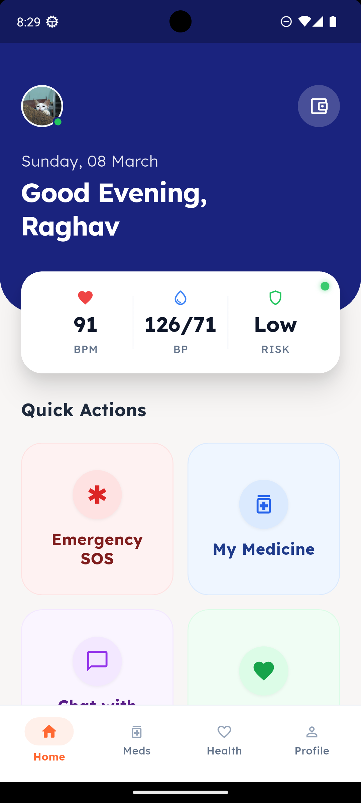</td>
    <td>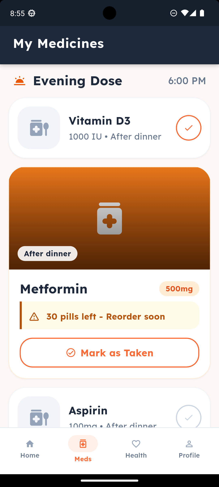</td>
    <td>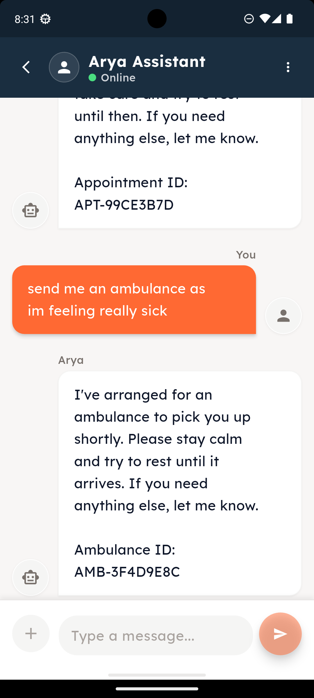</td>
    <td>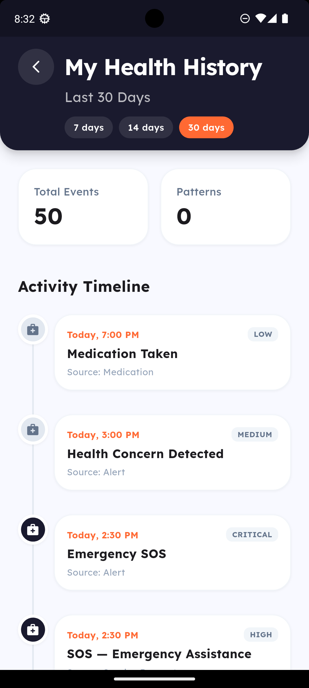</td>
  </tr>
  <tr>
    <td>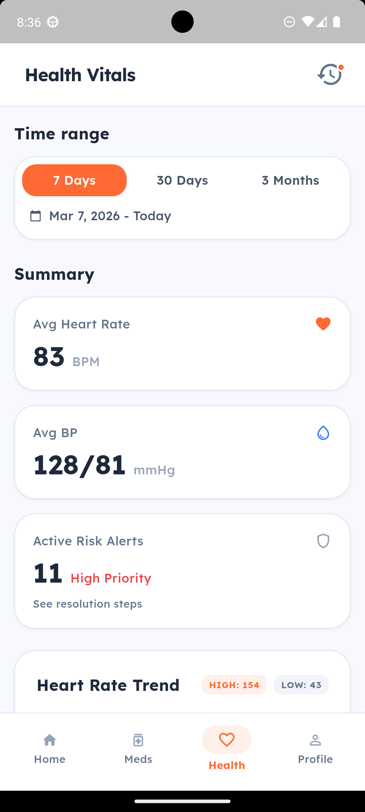</td>
    <td>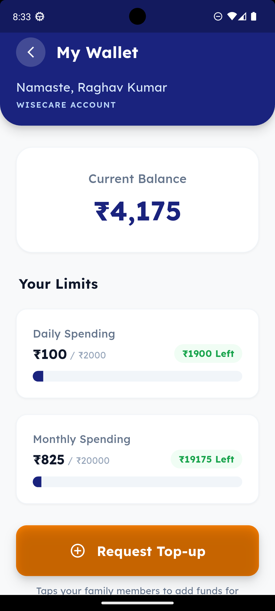</td>
    <td>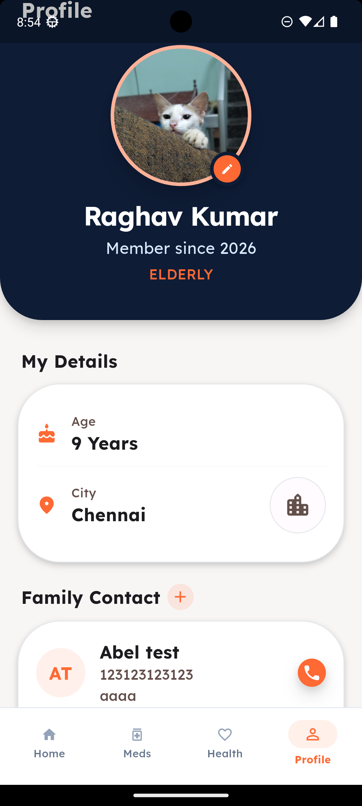</td>
    <td>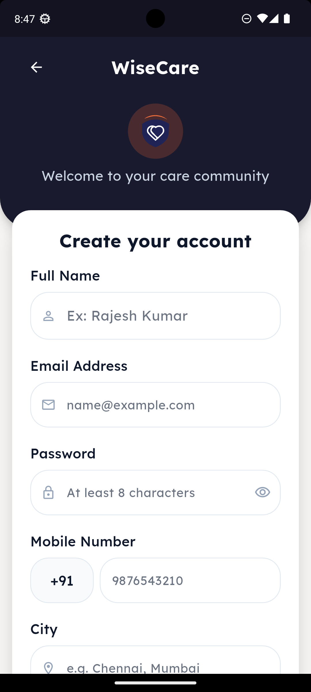</td>
  </tr>
  <tr>
    <td>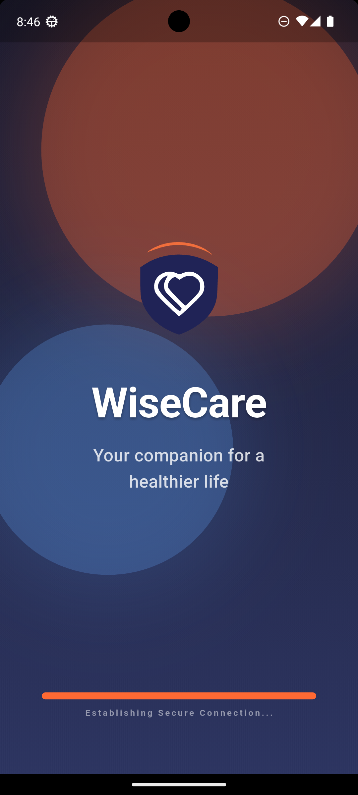</td>
    <td>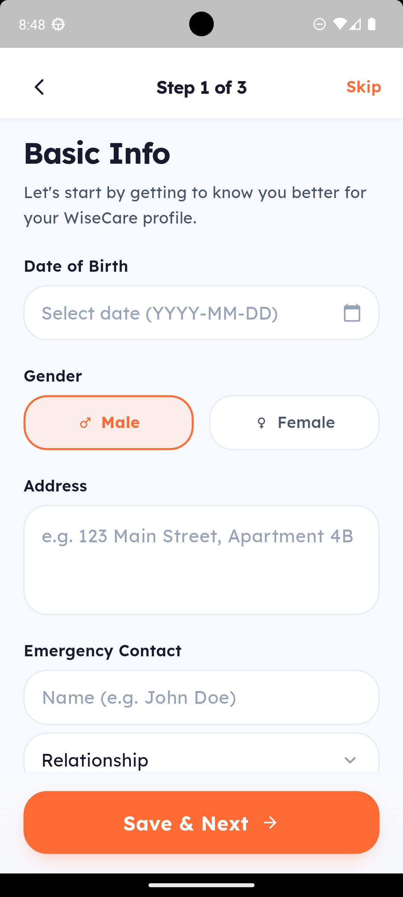</td>
    <td>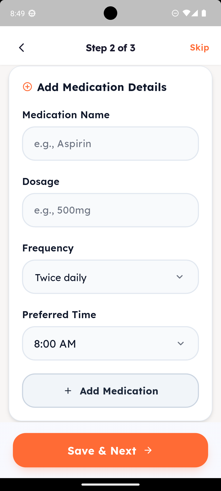</td>
    <td>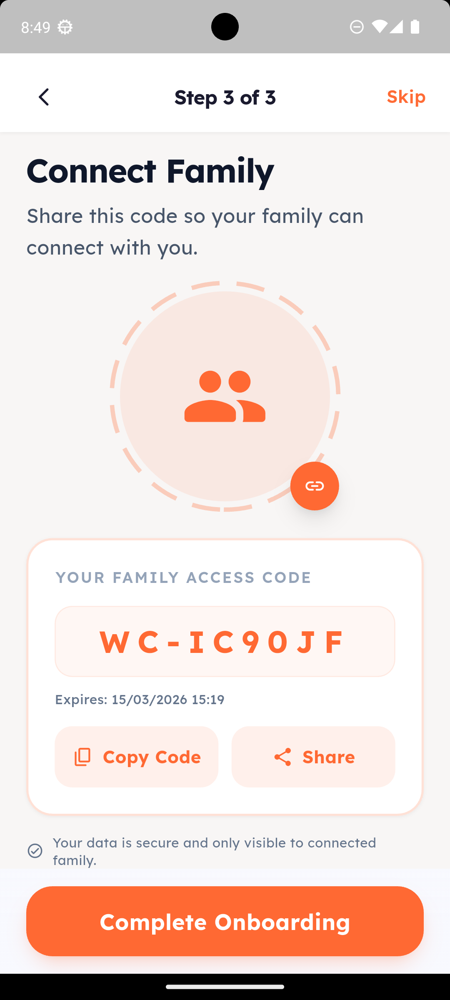</td>
  </tr>
</table>
