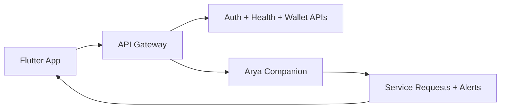

# WiseCare

Your calm little health copilot.

WiseCare helps families care better without turning health tracking into a full-time job.

## Live Demo

- [WiseCare](https://wisecaremob.vercel.app)

## Quick Nav

- [What You Can Do](#what-you-can-do)
- [Screen Peek](#screen-peek)
- [How It Works](#how-it-works)
- [For Geeks and Nerds](#for-geeks-and-nerds)
- [A Short Story](#a-short-story)

## What You Can Do

- Sign in, onboard, and get started fast
- Track meds, vitals, and risk trends
- Chat with Arya for help and support
- Trigger SOS in emergencies
- Manage wallet and profile in one place

## Screen Peek

Main app highlights.

| Home | Meds | Arya Chat |
|---|---|---|
|  |  |  |

## How It Works

In plain English: users tap a button, backend does the heavy lifting, and the app stays simple and friendly.

## For Geeks and Nerds

Want the full technical breakdown, architecture, API context, and folder structure?

Read [DETAILED.md](./DETAILED.md).

## A Short Story

Raghav is 72, lives in Chennai, and tells everyone he is "totally fine" even when he skips medicine and downplays symptoms.

His daughter, Meera, lives in another city and checks in whenever she can. With WiseCare, she does not need to guess anymore. She can see trends, get alerts, and know when something actually needs attention.

One evening, Raghav feels dizzy and taps SOS. WiseCare routes the alert, starts support workflows, and keeps the family informed. What could have become panic becomes coordinated action.

That is the point of WiseCare: less fear, faster help, and more dignity for everyone involved.

